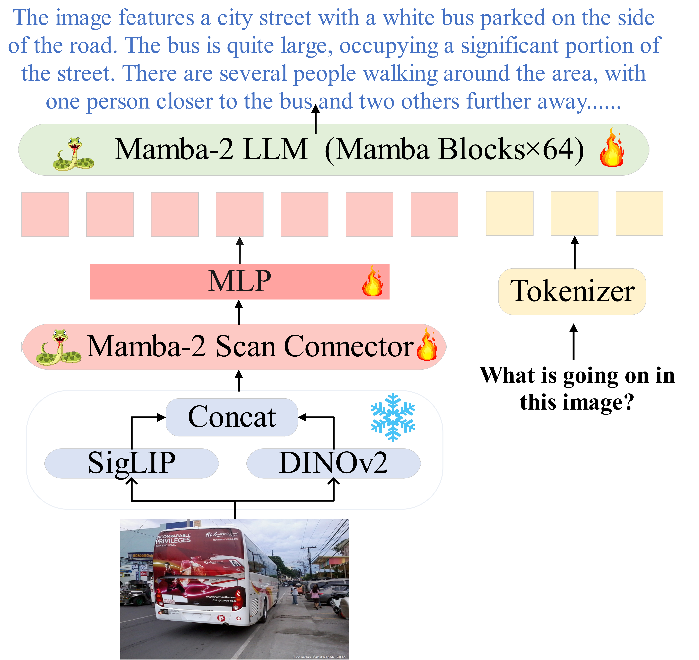

<div align="center">

 <h2> <a href="https://wenjunhuang94.github.io/ML-Mamba/">ML-Mamba: Efficient Multi-Modal Large Language Model Utilizing Mamba-2</a></h2>

[Wenjun Huang](https://wenjunhuang94.github.io/), [Jianguo Hu](https://ieeexplore.ieee.org/author/37536384400)



</div>

## Introduction
Multimodal Large Language Models (MLLMs) have attracted much attention due to their multifunctionality. However, traditional Transformer architectures incur significant overhead due to their secondary computational complexity. To address this issue, we introduced ML-Mamba, a multimodal language model that utilizes the latest and efficient Mamba-2 model for inference. Mamba-2 is known for its linear extension and fast processing of long sequences. We replaced the Transformer based backbone with a pre trained Mamba-2 model and explored methods for integrating 2D visual selective scanning mechanisms into multimodal learning. We also tried various visual encoders and Mamba-2 model variants. Our extensive experiments conducted in various multimodal benchmark tests have demonstrated the competitive performance of ML-Mamba and highlighted the potential of state space models in multimodal tasks. The experimental results show that: (1) ML-Mamba achieves performance comparable to state-of-the-art methods such as TinyLaVA and MobileVLM v2 through its linear sequential modeling, while also having faster inference speed; (2) ML-Mamba performs well in visual hallucinations and spatial relationship judgment in closed set benchmark tests; (3) ML-Mamba achieved performance comparable to LLaVA while reducing the number of parameters by 40\%.(4) Compared to the multimodal model using the original Mamba model, the Mamba-2 based large-scale multimodal language model has stronger inference performance and effectiveness. We will open source ML-Mamba to promote research on computational complexity in MLLMs.
## Notice
**The code will be released gradually in the next few days.**

## Update
(2024/07/25) The repository is created.

## License
This project is released under the [MIT License](LICENSE.txt)

## Citation
```
@misc{huang2024mlmamba,
      title={ML-Mamba: Efficient Multi-Modal Large Language Model Utilizing Mamba-2},
      author={Wenjun Huang and Jianguo Hu},
      year={2024},
      eprint={2407.19832},
      archivePrefix={arXiv},
      primaryClass={cs.CV},
      url={https://arxiv.org/abs/2407.19832},
}
```

## Acknowledgement

This repository is built based on [LLaVA](https://github.com/haotian-liu/LLaVA),  [Mamba](https://github.com/state-spaces/mamba), and [Transformers](https://github.com/JLTastet/transformers/tree/mamba) for their public code release.