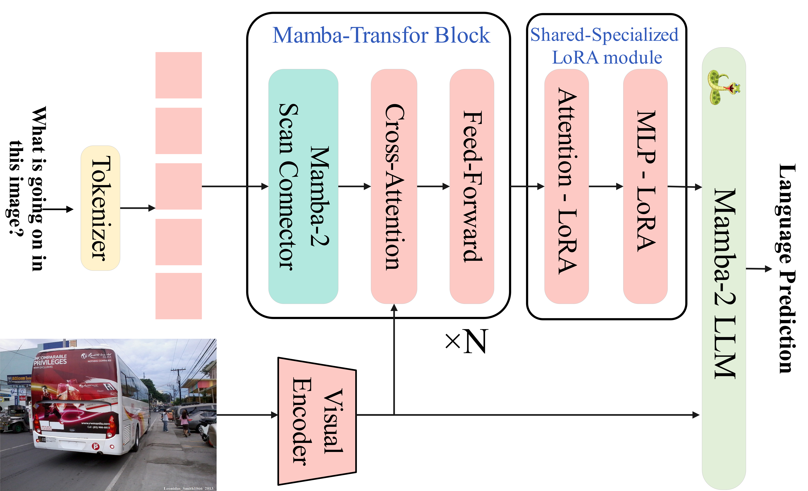

<div align="center">

 <h2> Enhancing Multimodal Large Language Models with Efficient Feature Alignment and Processing Using State Space Models</h2>





</div>

## Introduction
Multimodal Large Language Models (MLLMs) have demonstrated impressive capabilities in processing and understanding complex tasks involving both visual and textual data. However, their widespread application is often limited by the computational intensity required by traditional Transformer architectures, which can impede adaptability and efficiency, especially in diverse, multimodal environments. Existing Mamba-based multimodal models, while promising, often face challenges in achieving efficient feature alignment and maintaining computational efficiency, which can limit their performance in real-world applications. To address these challenges, we present ML-Mamba, an innovative model that significantly enhances multimodal learning by utilizing the Mamba-2 architecture. By integrating state space models with parameter-efficient fine-tuning methods, ML-Mamba offers linear scalability and the ability to process long sequences swiftly, effectively reducing reliance on Transformers. Our design incorporates a Mamba-Transformer block alongside shared-specialized Low-Rank Adaptation (LoRA) modules, optimizing feature alignment and minimizing the computational resources needed for task-specific adaptations. Extensive experimentation across various benchmarks highlights ML-Mamba's competitive performance, showcasing its enhanced inference speed and superior capability in aligning multimodal features. This work illustrates the promising potential of combining state space models with efficient fine-tuning strategies to create scalable, adaptable, and resource-efficient multimodal models.

[**Installation**](#installation) | [**Usage**](#usage) | [**Training VLMs**](#training-vlms) | [**License**](#license)
---

## Installation

This repository was built using Python 3.10, but should be backwards compatible with any Python >= 3.8. We require PyTorch 2.1 or greater installation instructions [can be found here](https://pytorch.org/get-started/locally/). This repository was developed and has been thoroughly tested with PyTorch 2.1.0 and Torchvision 0.16.0.

Once PyTorch has been properly installed, you can install this package locally via an editable installation

```bash
conda create -n ML-Mamba python=3.10
conda activate ML-Mamba
cd ML-Mamba
pip install -e .

# install mamba and other packages
cd causal-conv1d-main && pip install -e . && cd ..
cd mamba && pip install -e . &&  cd .. 
pip install packaging ninja

# Verify Ninja --> should return exit code "0"
ninja --version; echo $?

# option
pip install --upgrade Pillow
pip install --upgrade numpy
pip install --upgrade huggingface_hub
pip install numpy==1.21.2
pip install --upgrade click
```

If you run into any problems during the installation process, please file a GitHub Issue.

## Usage

Once installed, loading and running inference with pretrained `ML-Mamba` models is easy:

*First, you need to create a **.hf_token** file in the ML-Mamba project directory and fill in your Huggingface token.*

```python
import requests
import torch

from PIL import Image
from pathlib import Path

from mlmamba import load

hf_token = Path(".hf_token").read_text().strip()
device = torch.device("cuda") if torch.cuda.is_available() else torch.device("cpu")
# In case your GPU does not support bf16
dtype = torch.bfloat16 if torch.cuda.is_bf16_supported() else torch.float16 

# Load a pretrained VLM (either local path, or ID to auto-download from the HF Hub) 
model_id = "mlmamba+3b"
vlm = load(model_id, hf_token=hf_token)

vlm.to(device, dtype=dtype)
image = Image.open("pic/test0.png").convert("RGB")
user_prompt = "Provide a detailed description of this image"

# Build prompt
prompt_builder = vlm.get_prompt_builder()
prompt_builder.add_turn(role="human", message=user_prompt)
prompt_text = prompt_builder.get_prompt()

# Generate!
generated_text = vlm.generate(
    image,
    prompt_text,
    use_cache=True,
    do_sample=True,
    temperature=1.0,
    max_new_tokens=512,
)

print(f'user_prompt : {user_prompt} \ngenerated_text : {generated_text}')
```

For a complete terminal-based CLI for interacting with our VLMs, check out [scripts/generate.py]. 

---


## Training VLMs

#### Pretraining Datasets
The [LLaVa v1.5 Instruct Dataset](https://github.com/haotian-liu/LLaVA/blob/main/docs/Data.md) can be downloaded by the automated download script in [`scripts/preprocess.py`]:

```bash
# Download the `llava-v1.5-instruct` (Instruct Tuning) Image and Language Data (includes extra post-processing)
python scripts/preprocess.py --dataset_id "llava-v1.5-instruct" --root_dir <PATH-TO-DATA-ROOT>

# (In case you also wish to download the explicit vision-language alignment data)
python scripts/preprocess.py --dataset_id "llava-laion-cc-sbu-558k" --root_dir <PATH-TO-DATA-ROOT>
```

[LVIS-Instruct-4V](https://arxiv.org/abs/2311.07574) and [LRV-Instruct](https://arxiv.org/abs/2306.14565) can also be downloaded by the scripts in [`scripts/additional-datasets`].

#### Model Configuration & Training Script
Here's how you would train ML-Mamba follow the training recipe in our paper across 8 GPUs on a single-node: 

*First, you need to create a **.hf_token** file in the ML-Mamba/scripts project directory and fill in your Huggingface token.*

```bash
# Run from the root of the repository
torchrun --standalone --nnodes 1 --nproc-per-node 8 scripts/pretrain.py \
  --model.vision_backbone_id "dinosiglip-vit-so-384px" \
  --model.image_resize_strategy "resize-naive" \
  --model.llm_backbone_id "mamba2-2.7b" \
  --model.type "mlmamba+3b" \
  --model.finetune_global_batch_size 128 \
  --model.finetune_per_device_batch_size 8 \
  --dataset.type "llava-v15"
```

---

## ML-Mamba Evaluation

The evaluation code for the ML-Mamba project is located in the `vlm-evaluation` directory. Please follow the detailed instructions provided in `vlm-evaluation/README.md` to run the evaluation.

---

### License
This project is released under the [MIT License](LICENSE.txt)